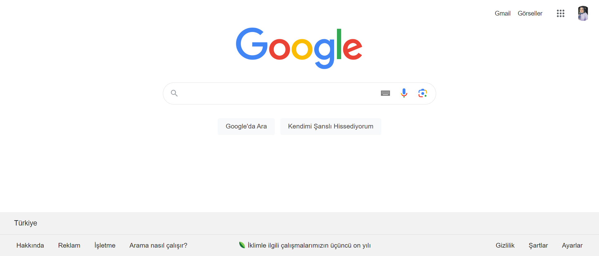

# GOOGLE CLONE
## Live Link: https://main--calm-souffle-1b8f6d.netlify.app/

Google anasayfası incelendi ve benzeri görsel olarak clonlanmaya çalışıldı.

---
### Technologies
- HTML
- CSS
---
### Project Design
- The project design is inspired by the Google homepage.
- In the header section there are gmail, images, google applications and user profile photo.
- In the main section, there is the Google logo, search area and 2 buttons.
- There are 7 sections in the footer section.
---
### Images
Original Google image:

My clone image:

---
---
# GOOGLE KLONU
## Canlı bağlantı: https://main--calm-souffle-1b8f6d.netlify.app/
Google anasayfası incelendi ve benzeri görsel olarak klonlandı.

---
### Teknolojiler
- HTML
- CSS
---
### Proje Tasarımı
- Proje tasarımı Google anasayfasından bakılarak tasarlanmıştır.
- Header kısmında gmail, images, google uygulamaları ve kullanıcı profil fotoğrafı bulunmaktadır.
- Ana bölümde google logosu, search alanı ve 2 adet buton bulunmaktadır.
- Footer kısmında ise 7 bölüm bulunmaktadır.
